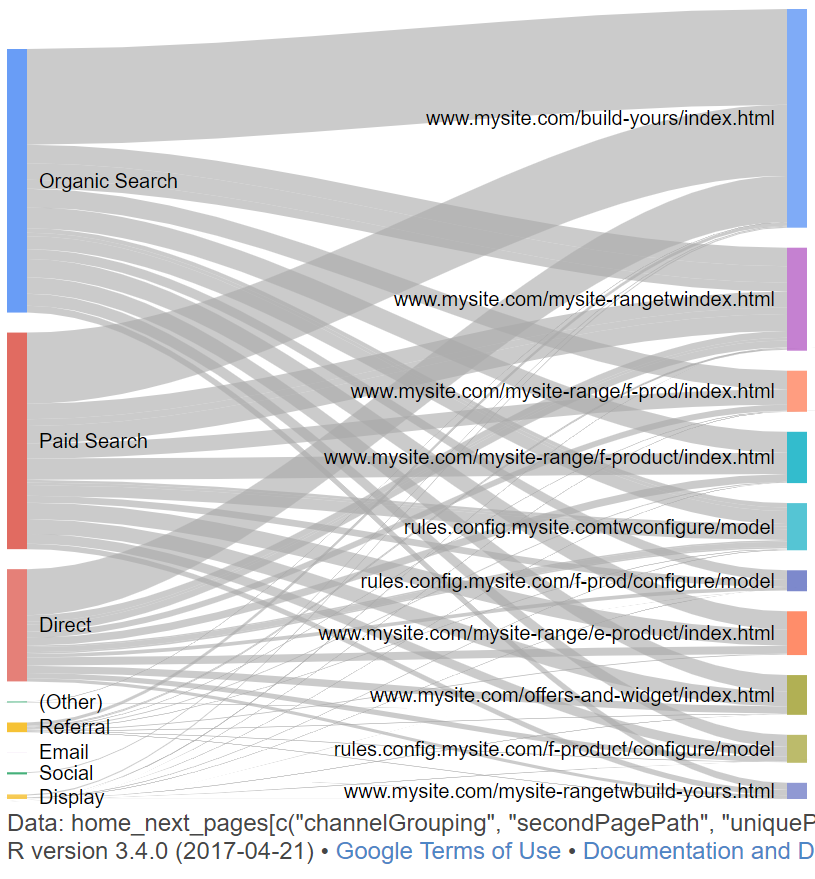
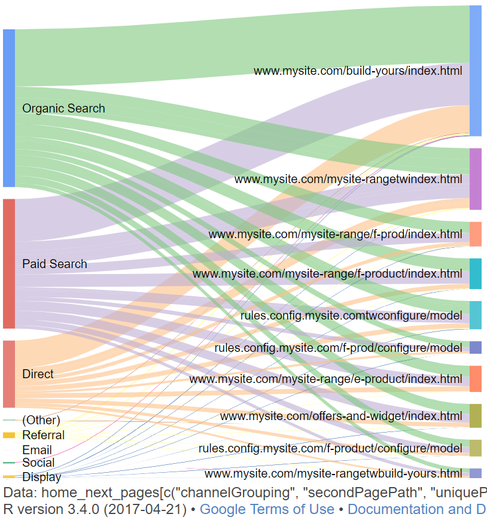
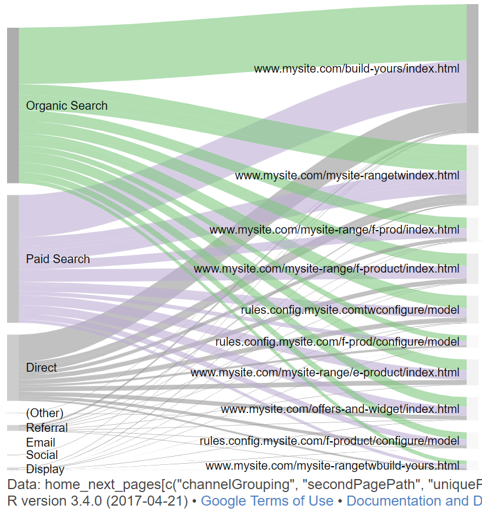

This example creates a Sankey chart to show how traffic flows from the homepage, split by device category. 

Steps to achieve this are:

1. Call `google_analytics_4` to get unique pageviews, split by the secondPagePath dimension. We apply a dimension filter to limit the results only to users landing on our website homepage.
2. Filter our results to the top 20 pages only, to avoid creating an indecipherable diagram with too many possible paths.
3. Build our plot with the resulting dataframe. We use the `googleVis` package library and build a `gvisSankey` plot. We set some options to colour traffic paths according to the referring `channelGrouping` for our visitors. 

These examples were built thanks to the excellent articles on r-bloggers.com by Tony Hirst. For more information, see:

- https://www.r-bloggers.com/experimenting-with-sankey-diagrams-in-r-and-python/
- https://github.com/psychemedia/parlihacks/blob/master/Rmd/sankeyFlow.Rmd


---

## Initial setup

We first call the libraries we'll be using:

```{r setup, warning = FALSE, message = FALSE}
if (!require(googleAnalyticsR)) install.packages("googleAnalyticsR")
if (!require(tidyverse)) install.packages("tidyverse")
if (!require(ggplot2)) install.packages("ggplot2")
if (!require(googleVis)) install.packages("googleVis")
```

## Building filter clauses

Now we're ready to make our call to the `google_analytics_4` function. We'll pull the `uniquePageViews` metric, combined with the `channelGrouping` and `secondPagePath` ([read about this metric in the GA reporting documentation](https://developers.google.com/analytics/devguides/reporting/core/dimsmets#view=detail&group=page_tracking&jump=ga_secondpagepath)). 

Before making the call, we need to build a `filter_clause_ga4`, containing one `dim_filter` to get data **only** for sessions where our users landed on the homepage of our site. Mark Edmondson has written some very helpful documentation on the new filter clauses - [read the documentation here](http://code.markedmondson.me/googleAnalyticsR/v4.html#new-filter-syntax).

The code below will build a list which can be passed as an argument to our `google_analytics_4` request. We use a [regular expression](https://www.rstudio.com/wp-content/uploads/2016/09/RegExCheatsheet.pdf) to identify the homepage of our fictitious website as the landing page.

```{r filters, warning = FALSE, message = FALSE, eval = FALSE}
  # Create page filter object
  page_filter <- dim_filter(
    dimension = "landingPagePath",
    operator = "REGEXP",
    expressions = "mysite.com\\/index\\.htm")
  homepage_filter <- filter_clause_ga4(list(page_filter))
```

Now, we're ready to pull the data from the GA API. We build a `google_analytics_4` request, passing the `homepage_filter` to the `dim_filters` argument.

```{r get_ga_data, warning = FALSE, message = FALSE, eval = FALSE}
home_next_pages <- google_analytics_4(
    viewId = "90210",
    date_range = c("2017-03-01", "2017-09-30"),
    dimensions = c("secondPagePath", "channelGrouping"),
    metrics = "uniquePageviews",
    dim_filters = homepage_filter,
    max = -1,
    anti_sample = TRUE
  )
```

At this point, you should have a data frame containing unique pageviews per next page for visits which started on your homepage, split by traffic source. If you'd like to follow along, you can download the toy data set from [this link](https://storage.googleapis.com/dartistics/unique_pvs.csv) or use the code below to read the file into your environment.

```{r get_toy_data, message = FALSE}
if(!file.exists("datafiles")) dir.create("datafiles")
download.file("https://storage.googleapis.com/dartistics/unique_pvs.csv", "datafiles/unique_pvs.csv")
home_next_pages <- read.csv("datafiles/unique_pvs.csv", stringsAsFactors = FALSE)
```

Here's how the file should look:

```{r headbang}
head(home_next_pages, 5)
```

However - we have a small problem in the number of possible next pages for our sessions:

```{r next_page_numbers}
length(unique(home_next_pages$secondPagePath))
```

As there are 150 possible pages available, we should thin this down to a number which can be easily visualised. We'll group the data by page path, arrange in order of pageviews and filter out the 140 lower-volumes pages.

We build the data frame of top 10 pages:

```{r slim_down}
top_10 <- home_next_pages %>% 
  group_by(secondPagePath) %>% 
  summarise(upvs = sum(uniquePageviews)) %>% 
  top_n(10, upvs) %>% 
  arrange(desc(upvs))
top_10
```

Using this list of our top 10 pages, we use the `semi_join` function from `dplyr` to restrict our list of pages & channels to these top 10.

```{r slim_again}
home_next_pages <- home_next_pages %>% 
  semi_join(top_10, by = "secondPagePath")
```

Now we have a data frame ready for plotting, using our top 10 pages.

```{r}
# Only 10 unique URLs are in our results, now
length(unique(home_next_pages$secondPagePath))
```


## Plotting the flows

### First basic plot

We'll make use of the `gvisSankey` function to build our plot ( [read the function documentation](https://www.rdocumentation.org/packages/googleVis/versions/0.6.0/topics/gvisSankey) ).

The `chartid` argument can be used to give your chart a custom id if you wish. However, note that the library will render a blank chart if the supplied ID contains any whitespace.

```{r plot_first, eval = FALSE}
# Reordering colums: the gVisSankey function doesn't take kindly
# if our df columns aren't strictly ordered as from:to:weight
home_next_pages <- home_next_pages %>% 
  select(channelGrouping, secondPagePath, uniquePageviews)

# Get rid of whitespace in our chart id
chart_id <-  "My Sankey Chart 1" %>% 
  gsub(" ", "_", .) %>% 
tolower()

# Build the plot
s <- gvisSankey(home_next_pages,
                chartid = chart_id)
plot(s)
```

```{r, out.width = "400px", echo = FALSE}

```

### Second plot - colour by traffic source

Our first chart is a nice enough start, but pretty messy and hard to discriminate between traffic sources. We should try to colour node links according to the source (`channelGrouping`).

You can control the appearance of your sankey chart, including link colours, by passing `options` values in using a json object or as part of a list. I find it easier to write the values as json, for readability.

We have 8 possible channel groupings in our GA data, so we need 8 colour values for the links.
We can generate these colour values as hex codes using the [colorbrewer](http://colorbrewer2.org/#type=qualitative&scheme=Accent&n=8) website. Colorbrewer helps to ensure our colours can be differentiated and follow good practice for data visualisation.

```{r colours}
# 8 values from colorbrewer - note the use of array notation
colour_opts <- '["#7fc97f", "#beaed4","#fdc086","#ffff99","#386cb0","#f0027f","#bf5b17","#666666"]'

# Set colorMode to 'source' to colour by the chart's source
opts <- paste0("{
        link: { colorMode: 'source',
                colors: ", colour_opts ," }
      }" )

```

This colour list can now be passed as an option to our `gvisSankey` call. We pass them to the `options` argument.

```{r plot_second, eval = FALSE}

s <- gvisSankey(home_next_pages,
                options = list(sankey = opts))
plot(s)
```


```{r, out.width = "400px", echo = FALSE}

```

This is a bit more useful. Still messy, but if you build your own plot, you'll notice that when you hover over each node, tooltips will appear to give you information about the source, destination and volume of pageviews.

### Third plot: highlight a specific traffic source

We may find it useful to limit the use of colour and focus on a subset of the data. Let's compare Paid Search and Organic search sources, and wash out the colour for all other traffic sources.

```{r colours_diverging}
# Diverging colours for the first 2 sources, then 25% grey for the rest
colour_opts <- '["#7fc97f", "#beaed4","#999999","#999999","#999999","#999999","#999999","#999999"]'

opts <- paste0("{
        link: { colorMode: 'source',
                colors: ", colour_opts ," },
        node: { colors: '#999999' }
      }" )

```

This colour list can now be passed as an option to our `gvisSankey` call.

```{r plot_third, eval = FALSE}
s <- gvisSankey(home_next_pages,
                options = list(sankey = opts))
plot(s)
```

```{r, out.width = "400px", echo = FALSE}

```

A bit easier to read. There is plenty more work that can be done, but hopefully this guide provides enough information to get you started. 

Remember that the number of next pages can be controlled to your preference. It could also be interesting to classify traffic by segment rather than `channelGrouping`, and use the segment types as your sources.

Full documentation on `googleVis` sankey charts can be found at
https://developers.google.com/chart/interactive/docs/gallery/sankey#controlling-colors
